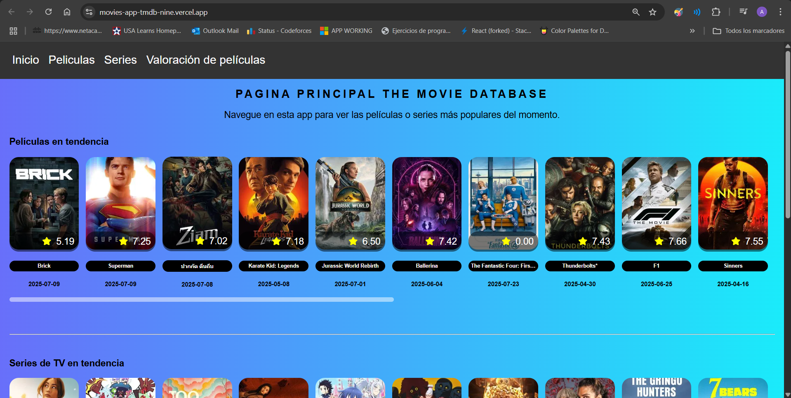
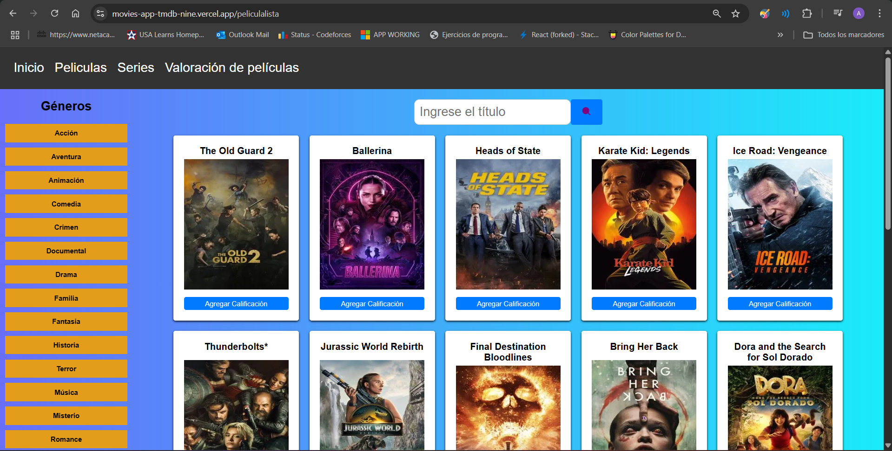
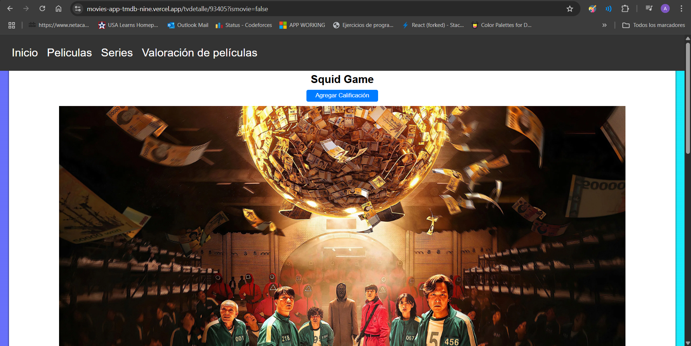
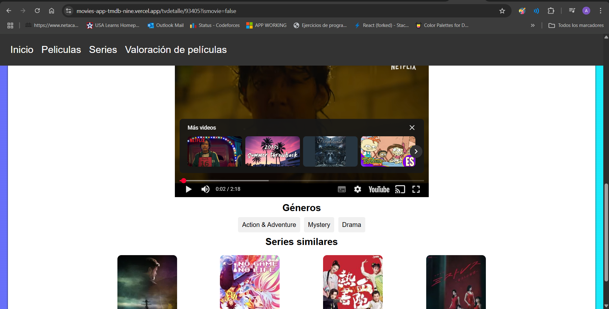
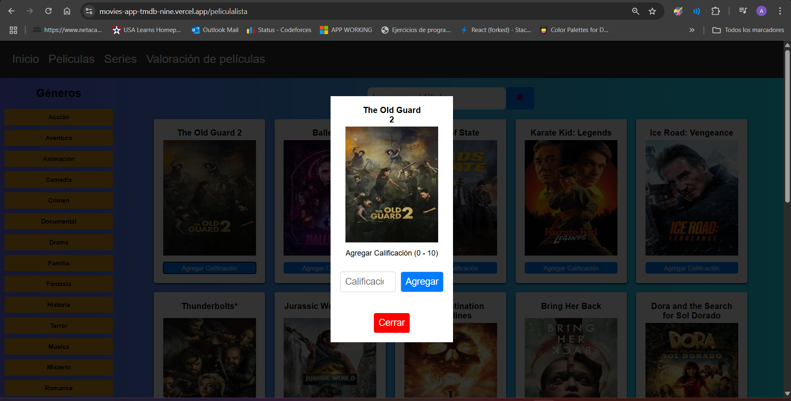
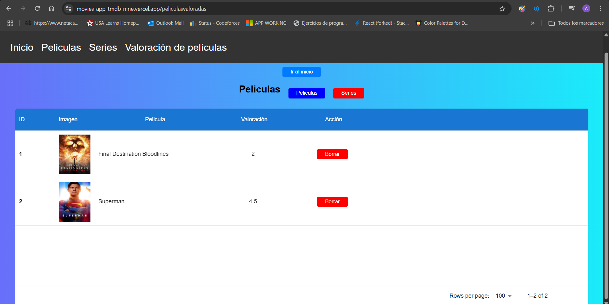

# 🎬 Movie & TV App TMDB

Aplicación web que consume la API de [TMDB (The Movie Database)](https://www.themoviedb.org/) para explorar películas y series de TV, el usuario puede listar contenido en tendencia, realizar busquedas por nombrem ver detalles de cada título, y dejar una valoración de 1 a 10 estrellas.

La aplicación esta desarrollada con [React](https://reactjs.org/) y se despliega en [Vercel](https://vercel.com/).

Puedes ver el proyecto en vivo en el siguiente enlace: [Movies-app-TMDB](https://movies-app-tmdb-nine.vercel.app/)


## 🚀 Características principales

- 🎞️ Listado de películas y programas de TV en tendencia y más valoradas.
- 🔍 Buscador de películas y series de TV, botón para ampliar la lista
- 📃 Detalle completo de cada título (título, descripción, fecha, puntuación, géneros, películas o series relacionadas.)
- ✅ Filtrado por tipo: Película o Serie de TV
- 📱 Responsive: Funciona en móviles, tablets y desktops

## 🛠️ Tecnologías utilizadas

- **Frontend:** React Vite
- **Consumo de API:** Fetch / Axios
- **Estilos:** CSS Modules
- **Routing:** React Router DOM

## 🧩 API utilizada

Se utiliza la [TMDB API v3](https://developer.themoviedb.org/docs) para obtener la información.

Para usarla necesitas una API Key gratuita, que puedes obtener creando una cuenta en TMDB.

## 🔧 Configuración del entorno

1. Clona el repositorio:

```bash
git clone https://github.com/Neira21/movies-app-tmdb.git
cd movies-app-tmdb
```

2. Instala las dependencias:

```bash
npm install
```

3. Crea un archivo `.env` en la raíz del proyecto y agrega tus variables de entorno:

```plaintext
VITE_API_URL = https://api.themoviedb.org/3
VITE_API_KEY = Tu API Key de TMDB que puedes obtener en https://www.themoviedb.org/settings/api
VITE_IMAGE_URL = ttps://image.tmdb.org/t/p/w200/
VITE_IMAGE_ORIGINAL = https://image.tmdb.org/t/p/original/
VITE_IMAGE_500 = https://image.tmdb.org/t/p/w500/

VITE_TOKEN=Tu Token que puedes obtener en https://www.themoviedb.org/settings/api
```


## 📷 Capturas de pantalla del proyecto


- Inicio de la aplicación, listado de películas y series en tendencia


- Lista de películas y lista de géneros


- Detalle de una película, portada y botones de valoración


- Detalle de película, descripción y títulos relacionados


- Añdir valoración a una película o serie de TV


- Lista de películas y series de TV valoradas

